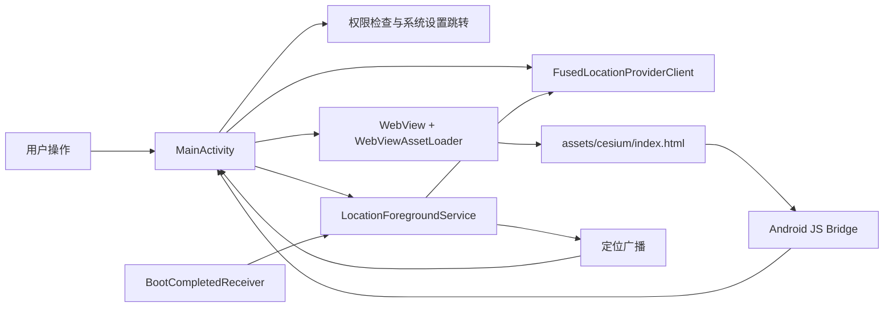

# LocationMobile

<p align="center">
  <strong>Android 三维移动定位与轨迹可视化应用</strong>
</p>

<p align="center">
  
  
  
  
  
</p>

LocationMobile 是一个基于 **Kotlin + Android WebView + Cesium.js** 的移动定位应用。它通过 Google Play Services 获取设备定位，在本地 Cesium 三维地球页面中实时展示当前位置、精度范围和移动轨迹，适合用于学习 Android 定位权限、前台服务、WebView 与三维地图可视化协作。

## 项目介绍

LocationMobile 把 Android 原生定位、前台持续定位服务和 Cesium 三维地图展示放在同一个应用里，目标就是把手机上的实时位置和移动路线直接展示到三维地球上。

这个项目目前更偏向示例和原型，比较适合下面这些场景：

- 学习 Android 定位权限申请、前台服务和后台持续定位
- 做三维地图定位演示，展示当前位置、精度圈和移动轨迹
- 作为 `Kotlin + WebView + Cesium.js` 的集成参考项目

应用负责采集和分发定位数据，WebView 中的 Cesium 页面负责三维渲染和轨迹可视化，两部分通过原生与前端桥接逻辑协同工作。

## 目录

- [项目介绍](#项目介绍)
- [功能亮点](#功能亮点)
- [技术栈](#技术栈)
- [快速开始](#快速开始)
- [使用说明](#使用说明)
- [项目结构](#项目结构)
- [架构概览](#架构概览)
- [权限说明](#权限说明)
- [常用命令](#常用命令)
- [配置与安全](#配置与安全)
- [常见问题](#常见问题)
- [路线图](#路线图)
- [贡献指南](#贡献指南)
- [许可证](#许可证)
- [致谢](#致谢)

## 功能亮点

- **三维地球定位展示**：基于 Cesium.js 在 WebView 中渲染三维地球。
- **单次定位**：点击按钮获取当前位置，并飞行到对应坐标。
- **持续轨迹跟踪**：通过前台定位服务持续采集位置并绘制轨迹线。
- **后台定位支持**：使用 `ForegroundService` + 通知栏常驻，支持应用退到后台后继续定位。
- **开机/更新后恢复**：若上次持续定位处于开启状态，设备重启或应用更新后可恢复定位服务。
- **轨迹节点控制**：支持显示/隐藏轨迹节点，便于查看路径走势。
- **多地图图层**：支持卫星影像、街道地图、天地图影像与标注图层切换。
- **安全的本地配置**：Cesium Ion 与天地图 Token 从本地 `tokens.properties` 注入，避免直接写入前端源码。
- **Release 签名保护**：发布包默认要求显式配置签名信息，且默认不注入地图 Token。

## 技术栈

| 类别 | 选型 |
| --- | --- |
| 语言 | Kotlin |
| Android Gradle Plugin | 8.2.2 |
| Kotlin Gradle Plugin | 1.9.22 |
| Gradle Wrapper | 8.2 |
| SDK | minSdk 26 / targetSdk 34 / compileSdk 34 |
| 定位 | Google Play Services Location 21.1.0 |
| WebView 资源加载 | AndroidX WebKit 1.8.0 / `WebViewAssetLoader` |
| 三维地图 | Cesium.js 1.112 |
| UI 基础库 | AndroidX AppCompat、Material Components、ConstraintLayout |

当前应用版本：`1.2.0`（`versionCode = 3`）。

## 快速开始

### 环境要求

- Android Studio 或 IntelliJ IDEA（已安装 Android 插件）
- JDK 17
- Android SDK API 34（运行设备需 Android 8.0 / API 26 及以上）
- 可用网络环境
- 真机或带定位能力的模拟器；真机建议开启 GPS 并在户外测试

### 1. 获取项目

```bash
git clone <your-fork-or-repo-url>
cd LocationMobile
```

如果你已经在本地拥有项目，直接用 Android Studio / IntelliJ IDEA 打开项目根目录即可。

### 2. 配置 Android SDK

通常 Android Studio 会自动生成 `local.properties`。如果需要手动创建，可在项目根目录写入：

```properties
sdk.dir=C\:\\Users\\你的用户名\\AppData\\Local\\Android\\Sdk
```

> `local.properties` 已在 `.gitignore` 中忽略，不应提交到仓库。

### 3. 配置地图 Token

复制示例配置文件：

```powershell
Copy-Item app\tokens.properties.example app\tokens.properties
```

macOS / Linux 可使用：

```bash
cp app/tokens.properties.example app/tokens.properties
```

然后编辑 `app/tokens.properties`，填入你的 Token：

```properties
CESIUM_ION_TOKEN=你的CesiumIonToken
TIANDITU_TOKEN=你的天地图Token
```

- Cesium Ion Token：<https://cesium.com/ion/tokens>
- 天地图 Token：<https://console.tianditu.gov.cn>

说明：

- `debug` 构建会在构建期把 Token 注入 `BuildConfig`，再由原生侧注入到 Cesium 页面。
- `release` 构建默认不注入 Token，避免将密钥随生产包分发。
- 不要直接把真实 Token 写进 `app/src/main/assets/cesium/index.html`。

### 4. 构建并运行 Debug 包

Windows：

```powershell
.\gradlew.bat assembleDebug
```

macOS / Linux：

```bash
./gradlew assembleDebug
```

也可以在 Android Studio 中选择 `app` 配置并点击运行。构建产物位于：

```text
app/build/outputs/apk/debug/
```

### 5. 可选：构建 Release 包

Release 构建需要配置签名信息。推荐使用环境变量：

```powershell
$env:LM_STORE_FILE="C:\path\to\release.keystore"
$env:LM_STORE_PASSWORD="your_store_password"
$env:LM_KEY_ALIAS="your_key_alias"
$env:LM_KEY_PASSWORD="your_key_password"
.\gradlew.bat assembleRelease
```

也可以复制并填写：

```powershell
Copy-Item app\keystore.properties.example app\keystore.properties
```

> `app/keystore.properties` 已被忽略，请勿提交真实签名文件或密码。

## 使用说明

1. 首次启动时授予前台定位权限。
2. 点击 **📍 获取位置** 获取一次当前位置，并在三维地球上显示标记与精度信息。
3. 点击 **🎯 开始跟踪** 开启持续定位；如需锁屏或后台持续定位，请按系统提示授予后台定位和通知权限。
4. 点击图层按钮切换 **卫星影像 / 街道地图 / 天地图**。
5. 使用轨迹节点开关控制轨迹采样点显示。
6. 点击 **🗑️ 清除标记** 清理当前地图上的定位标记与轨迹。

## 项目结构

```text
.
├── app/
│   ├── build.gradle                         # Android 应用模块构建配置
│   ├── tokens.properties.example            # 地图 Token 本地配置模板
│   ├── keystore.properties.example          # Release 签名配置模板
│   └── src/main/
│       ├── AndroidManifest.xml              # 权限、Activity、Service、Receiver 声明
│       ├── java/com/locationmobile/
│       │   ├── MainActivity.kt              # WebView、权限、定位交互与 JS Bridge
│       │   ├── LocationForegroundService.kt # 后台持续定位前台服务
│       │   └── BootCompletedReceiver.kt     # 重启/应用更新后恢复定位服务
│       ├── assets/
│       │   ├── cesium/index.html            # Cesium 地图页面与轨迹渲染逻辑
│       │   └── 定位.svg                     # 定位图标资源
│       └── res/                             # 布局、图标、字符串等 Android 资源
├── gradle/wrapper/                          # Gradle Wrapper
├── build.gradle                             # 根项目插件版本配置
├── settings.gradle                          # Gradle 项目声明
├── README.md                                # 项目说明文档
├── 快速开始.md                              # 早期快速开始说明
└── Gradle配置说明.md                        # Gradle 配置参考
```

## 架构概览



核心流程：

- `MainActivity` 通过 `WebViewAssetLoader` 加载本地 Cesium 页面，避免直接开启不安全的本地文件访问。
- Cesium 页面通过 `Android` JS Bridge 请求单次定位、开始跟踪、停止跟踪等原生能力。
- 持续定位由 `LocationForegroundService` 承担，并通过广播把坐标回传给 Activity。
- `BootCompletedReceiver` 在设备重启或应用更新后，根据本地追踪状态决定是否恢复服务。

## 权限说明

| 权限 | 用途 |
| --- | --- |
| `INTERNET` | 加载 Cesium、地图瓦片等网络资源 |
| `ACCESS_NETWORK_STATE` | 检查网络状态 |
| `ACCESS_FINE_LOCATION` | 获取高精度定位 |
| `ACCESS_COARSE_LOCATION` | 获取粗略定位 |
| `ACCESS_BACKGROUND_LOCATION` | 支持后台/锁屏持续定位 |
| `FOREGROUND_SERVICE` | 启动前台服务 |
| `FOREGROUND_SERVICE_LOCATION` | Android 14+ 前台定位服务类型声明 |
| `POST_NOTIFICATIONS` | Android 13+ 前台服务通知展示 |
| `RECEIVE_BOOT_COMPLETED` | 设备重启后恢复持续定位状态 |
| `WAKE_LOCK` | 已声明；当前定位主要依赖前台服务，后续可用于后台稳定性扩展 |

## 常用命令

```powershell
# 清理构建产物
.\gradlew.bat clean

# 构建 Debug APK
.\gradlew.bat assembleDebug

# 运行单元测试
.\gradlew.bat testDebugUnitTest

# 运行 Lint 检查
.\gradlew.bat lintDebug

# 构建 Release APK（需先配置签名）
.\gradlew.bat assembleRelease
```

## 配置与安全

请不要提交以下本地文件或敏感信息：

- `local.properties`
- `app/tokens.properties`
- `app/keystore.properties`
- 真实 `.keystore` / `.jks` 文件
- 任何真实 Token、密码、证书或签名密钥

仓库已通过 `.gitignore` 忽略上述常见敏感文件。如果需要在 CI/CD 中构建 Release，建议使用安全的 Secret 管理能力注入 `LM_STORE_FILE`、`LM_STORE_PASSWORD`、`LM_KEY_ALIAS`、`LM_KEY_PASSWORD` 等环境变量。

## 常见问题

### 地图空白或加载失败

- 检查网络是否可访问 Cesium 与地图瓦片服务。
- 确认 `app/tokens.properties` 已配置 `CESIUM_ION_TOKEN`。
- 如果使用天地图，确认 `TIANDITU_TOKEN` 有效；未配置时应用会回退到街道地图。
- 在 Logcat 中过滤 `LocationMobile` 查看 WebView 控制台与原生日志。

### 无法获取定位

- 确认已授予定位权限。
- 真机测试时开启 GPS，尽量在室外或信号较好的环境测试。
- 模拟器测试时，在 Extended Controls 的 Location 面板手动发送坐标。

### 后台定位不稳定

- 授予后台定位权限，并允许通知权限。
- 根据系统提示将应用加入电池优化白名单或“不受限制”列表。
- 某些厂商系统可能额外限制后台服务，需要在系统管家中单独放行。

### Release 构建失败

- `release` 构建必须配置签名信息。
- 使用环境变量或 `app/keystore.properties` 填入 `storeFile`、`storePassword`、`keyAlias`、`keyPassword`。
- 不要把真实签名配置提交到仓库。

### Gradle 同步失败

- 确认 Gradle JVM 使用 JDK 17。
- 确认 Android SDK API 34 已安装。
- 如果网络受限，请配置 Gradle / Android Studio 代理或镜像源。

## 路线图

- [ ] 增加截图与演示 GIF
- [ ] 增加轨迹导出（GeoJSON / GPX / CSV）
- [ ] 增加轨迹持久化与历史记录回放
- [ ] 增加 CI 构建与自动化检查
- [ ] 补充单元测试与 WebView/Cesium 交互测试
- [ ] 增加可选离线地图或缓存策略

## 贡献指南

欢迎提交 Issue 或 Pull Request。建议流程：

1. Fork 本仓库并创建功能分支。
2. 保持改动聚焦，避免提交本地配置、构建产物和敏感文件。
3. 提交前运行 `./gradlew assembleDebug` 或 `./gradlew.bat assembleDebug`。
4. 在 PR 中说明改动动机、测试方式和可能影响。

推荐提交信息风格：

```text
feat: add track export
fix: handle missing location permission
docs: improve readme
```

## 许可证

本项目基于 [Apache License 2.0](./LICENSE) 开源。你可以在遵守许可证条款的前提下自由使用、复制、修改和分发本项目。

## 致谢

- [Cesium](https://cesium.com/)：三维地球与地图可视化能力。
- [Google Play services Location](https://developers.google.com/android/reference/com/google/android/gms/location/package-summary)：Android 融合定位能力。
- [天地图](https://www.tianditu.gov.cn/)：可选地图瓦片与标注服务。
- [OpenStreetMap](https://www.openstreetmap.org/) 与 Esri World Imagery：地图图层参考。
